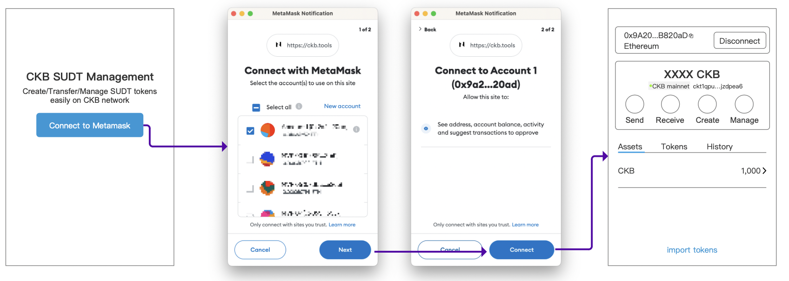
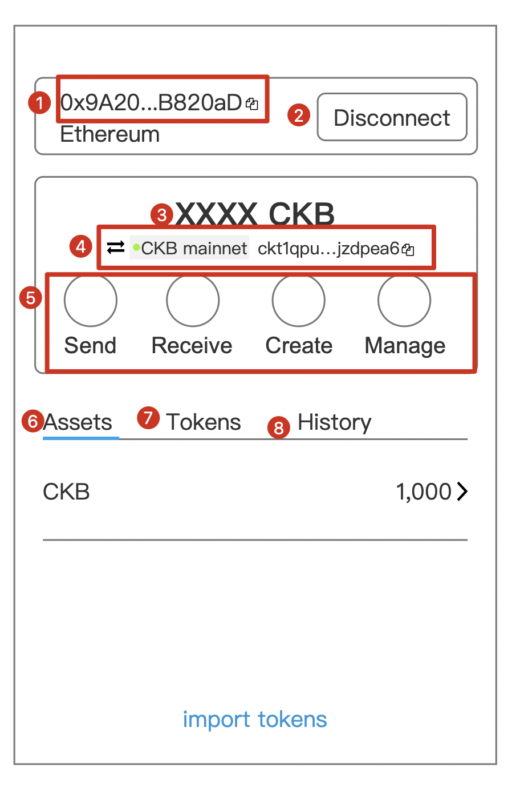
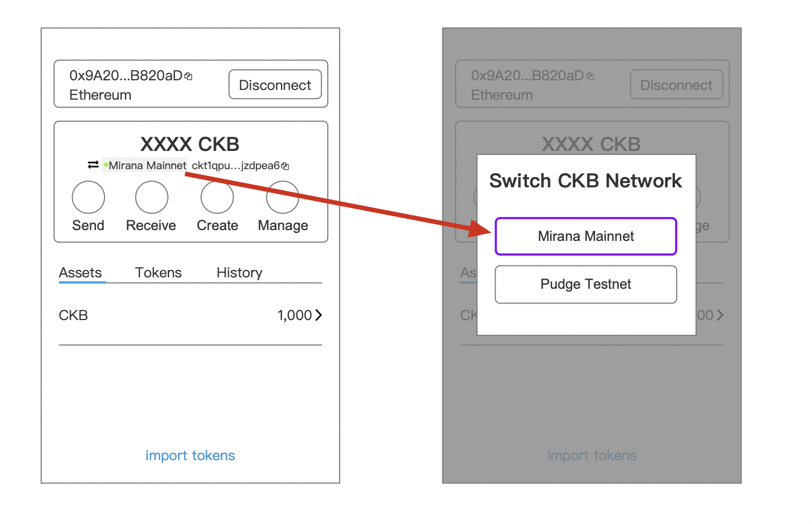
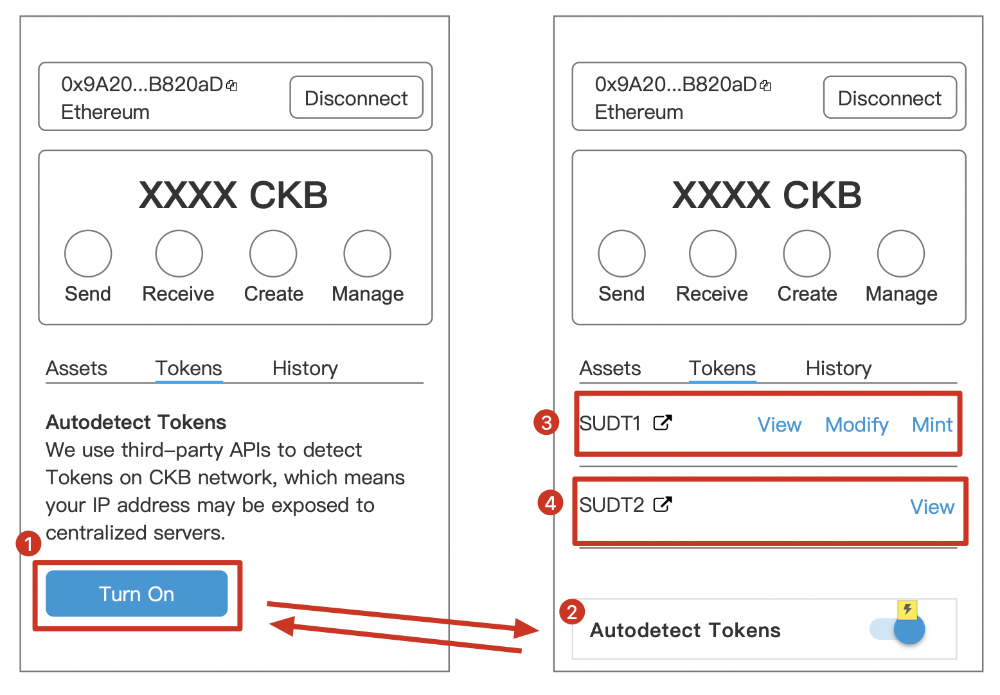
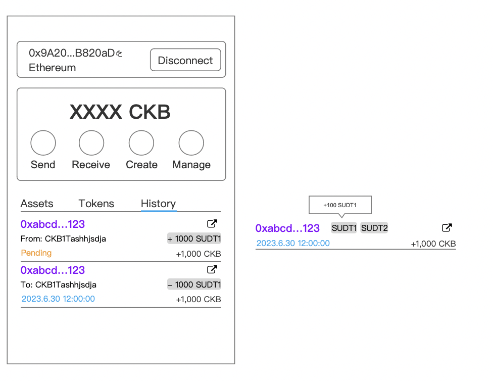
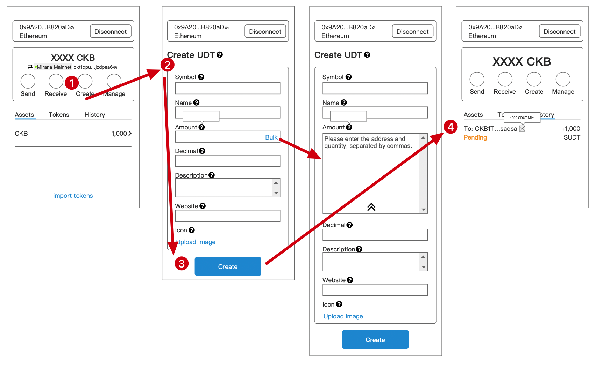
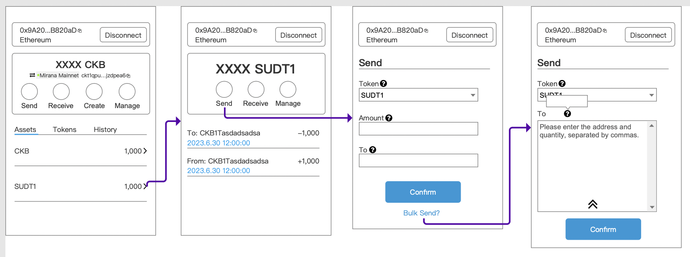
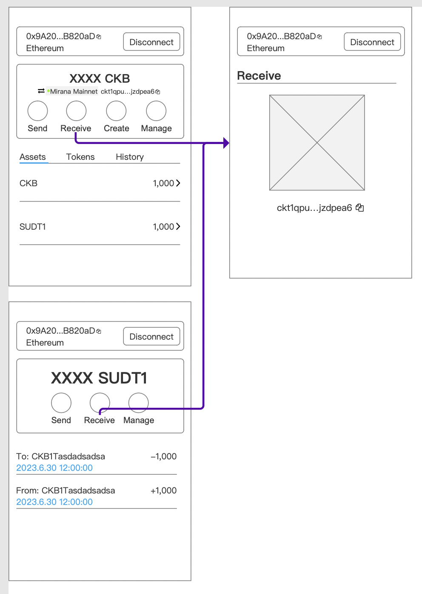
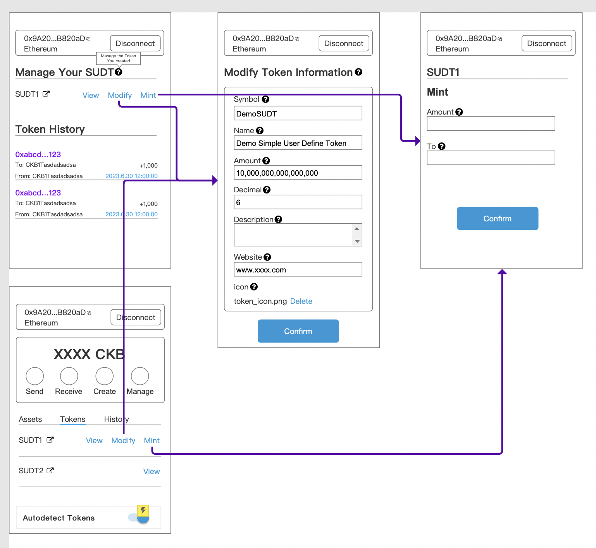
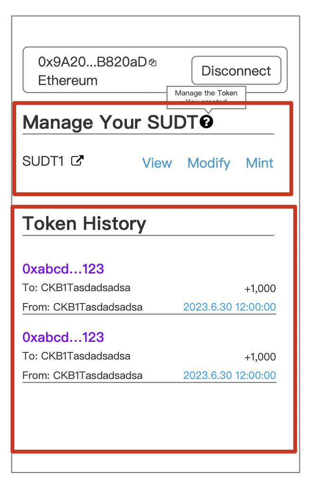

# User Stories of the Second demo

> Notes: The requirements mentioned here is for some specific requirement which is considerred general and easy to understand. Developers can adjust/modify/rewrite the whole implement once he understand the framework of kuai.

Second demo of Kuai is a sudt dapp which allows a Token Minter to create/mint/manage token and Holders to transfer token.

## Rules
- The SUDT tool allows users create SUDT tokens using just MetaMask.
- The account selected in MetaMask is used to generate the SUDT Token ID.
- This account is also the "owner" or "issuer" of the token, and the only account that can mint more tokens. 

## Roles

- Token Minter: The one who mint the SUDT and are able to manage tokens he minted
- Token Holder: Users who have access to the Token, he can transfer
- Normal Users: Users who many just want to view some info of token

## User story

- Token Minter: As a Token Minter, I minted the Token, so I can manage them, so

  - I can mint the token to an CKB address no matter when and how many I want.
  - I can update token info, they're name,symbol,icon,description and website

- Token Holder: As a Token Holder , some Token are in posession of me, so

  - I can transfer the Tokens I have

- Normal Users: As a normal user, I may be just interested in sudt, still,
  - I can view the token info
  - I can view the token distribution, like the holder list and Total minted Amount.
  - I can view the token transfer history.

## Flow

### Login
Users need to connect to the site by Metamask in order to log in and use this SUDT management tool.

  
1. Click the "Connect to Metamask" button on the login page;
2. Click "Next" and "Connect" Button on Metamask popup window;
3. The current metamask account will be connected to this site automatically.

### Root Page

After logging in, the user can check his assets.

  

There are several parts in this page:

1. Metamask Account display: This shows the account that user has connected to this site.
2. Disconnect button: Click to disconnect current account, and back to home page.
3. CKB balance: show the CKB balance of the corresponding ckb address of the ethereum format address. This value should update as quick as it can be.
4. CKB network & address: Show the network the user is going to work on and the corresponding address of the ethereum format address on this network.
5. Function Part: Privide 4 different functions that user can do with SUDT.
6. Asset Tab: The defaut tab where users can view his ckb and SUDT balance.
7. Tokens Tab: A Token List where display all the SUDT creadted by all users and of course the token minted by current user will display on the top.
8. History Tab: Users can check all their transaction history of the current account.

User Functions of these parts.
- Disconnect button: Users can disconnect or swicth account using the Disconnect button.
- Switch CKB network: Users can click switch icon to shift the CKB network they are going to work on.
  
- Choose to send/receive/create/manage SUDT

#### Asset Tab
Asset Tab shows all the tokens and assets the address contain.
- CKB balance will show on the top of this list.
- Asset Tab automaticly find the specific SUDT if current address mint, and show it behind CKB.
- Asset Tab automaticly search any other assets belongs to the address, and show its balance based on the SUDT's decimal. These SUDT will be sort by the balance Descendingly.
- Click the token line, then the page jump to the Token details.
#### Tokens Tab

Tokens Tab shows almost all the SUDT tokens in this case.

  

1. Users need to turn on the Token detector to abtain all the SUDT tokens in this case.
2. User can turn off the Token detector as well.
3. The SUDT creator can view/modify/mint Token.See more on Manage User created SUDT below.
4. User can view the Token Info of all detected Tokens.
  

Other Functions:
- Click the outlink icon will lead to the CKB explorer

#### History Tab

The historu tab show all transaction of current address including the pending transaction.

Two layout are provided below. The first layout display both the CKB change and SUDT change which base on 2 supposals that only one SUDT is included in this transaction, and these USDT comes from one address.
The second layout display CKB balance change of this address, and use tags to imply that there are some kinds of SUDT are involved in this transaction.

  

> If possible, the mint transaction and the modification transaction should be also tag or in the hover bubble.

### Initialize and distribute SUDT 
A new account usually dont have any other assets beyond CKB.
Thus user can create his own SUDT here. And distribute the SUDT to a list of addresses.
  
1. Click the create button on homepage
2. Fill the form which is necessary to create a SUDT.
3. Click create button to create the SUDT

> *While creating the SUDT, Users can mint the token to several address

### Send a Token
  

There are two ways to get into the SUDT Transfer page.

1. Go to the SUDT page and use the send function
2. Click the Send button on Root page, then select the right SUDT in TOKENS field.

> Bulk sending tokens could also be a useful function if possible.

### Receive a Token

Click the receive button on Root Page or any token page will lead to the receiving Page.
Copy the CKB address , and send it to Sender to promote the transaction.

  

### Manage User created SUDT

Token creater could manage the SUDT created by him/her for 2 ways:
1. Modify the token information
2. Mint more token to an address

  

- Modify the token information
  
  Clicking Modify Info button on Manage Page or Tokens Tab on Root Page will lead to the information page. Modify the information and then click Confirm button.

- Mint more token to an address

  Clicking Mint Button lead to the mint page.

#### About Manage Page
  

The Manage Page consists of 2 part: 
- SUDT pannel
- Token history: shows all confirmed Transaction of this token.
