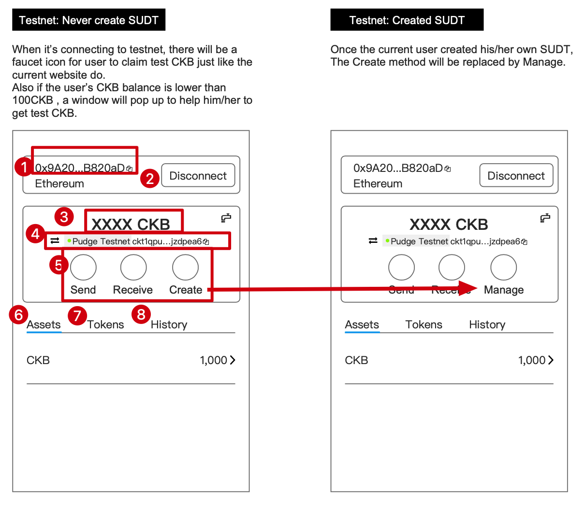
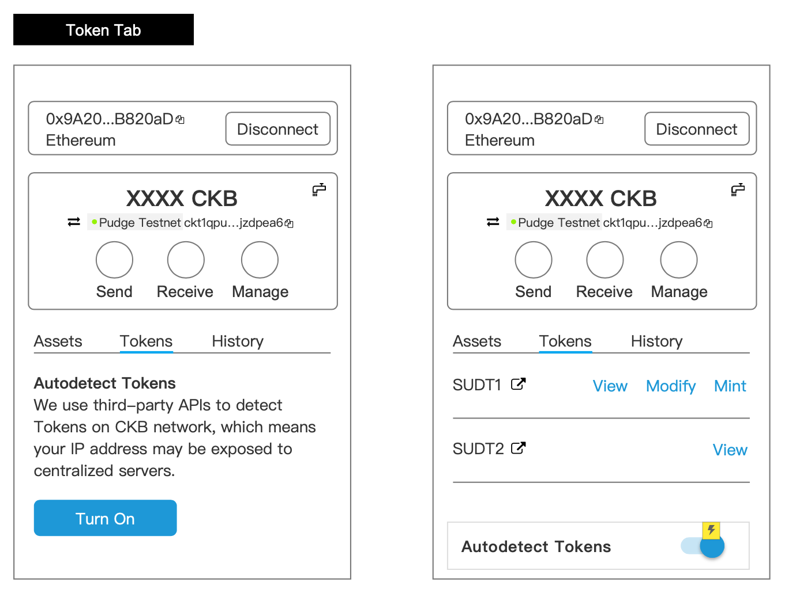
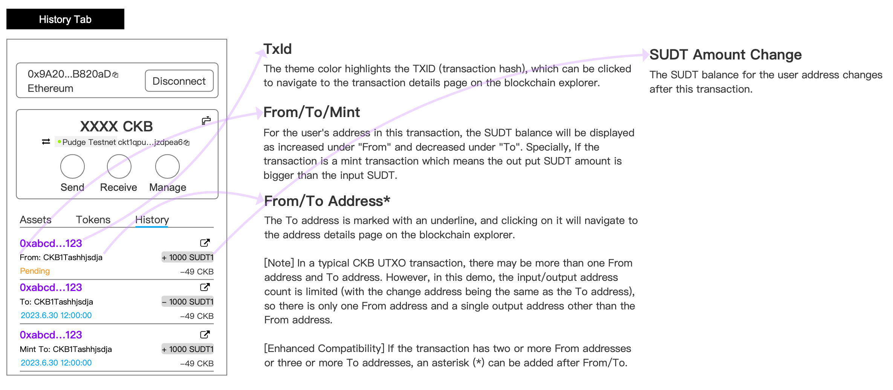
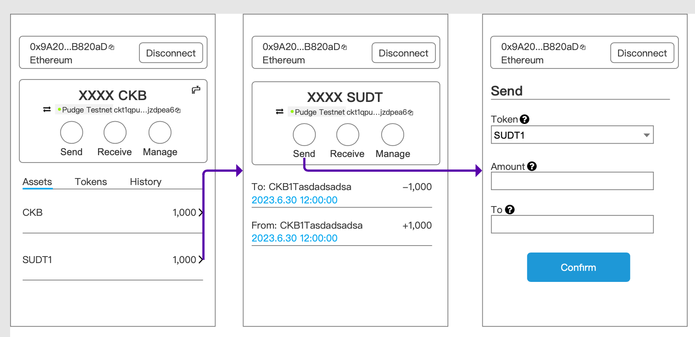
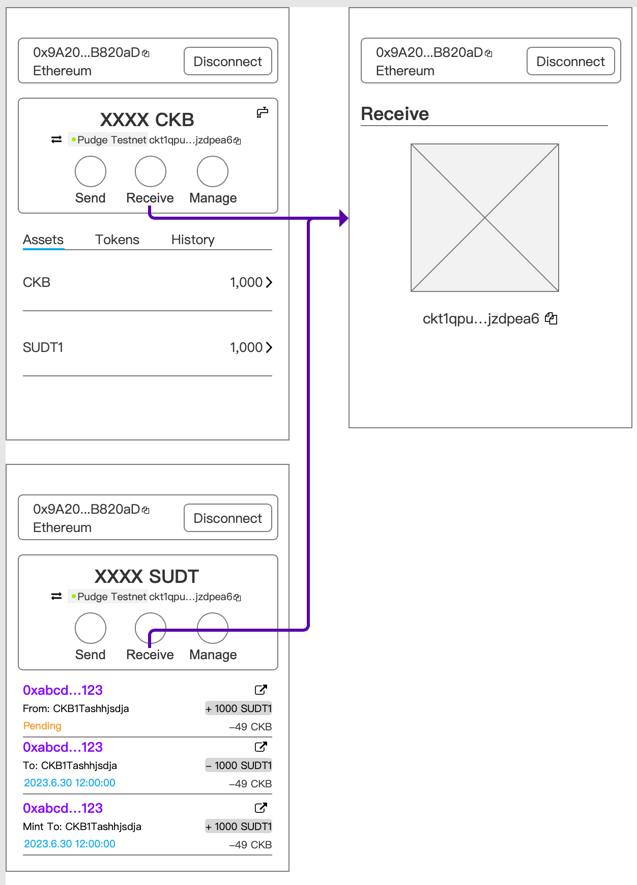

# User Stories of the Second demo

> Notes: The requirements mentioned here are for some specific requirements general and easy to understand. Developers can adjust/modify/rewrite the whole implementation once they understand the framework of kuai.

The second demo of Kuai is a sudt dapp which allows a Token Minter to mint/manage token and Holders to transfer token.

## Rules
- The SUDT tool allows users create SUDT tokens using just MetaMask.
- The account selected in MetaMask is used to generate the SUDT Token ID.
- This account is also the MINTER of the token, and the only account that can mint more tokens. 

## Flow

### Login
Users need to connect to the site by Metamask in order to log in and use this SUDT management tool.

  

1. Click the "Connect to Metamask" button on the login page;
2. Click "Next" and "Connect" Button on Metamask popup window;
3. The current metamask account will be connected to this site automatically.

> By default, the users will be connected to testnet, so there will be a Faucet link for them. New users who never create SUDT will be provided with the Create method; on the other hand, users who created SUDT will be provided with the Manage method.

### Root Page

After logging in, the user can check his assets.

  

There are several parts in this page:

<!-- 水龙头低于阈值,弹窗自动提示,facuet icon 可以考虑隐藏/换位置  -->

1. Metamask Account display: This shows the account that user has connected to this site.
2. Disconnect button: Click to disconnect current account, and back to home page.
3. CKB balance: show the CKB balance of the corresponding ckb address of the ethereum format address. This value should update as quick as it can be.
4. CKB network & address: Show the network the user is going to work on and the corresponding address of the ethereum format address on this network.
5. Function Part: Privide 4 different functions that user can do with SUDT. And the 3rd function will change based on to which kind of address current wallet connect.
6. Asset Tab: The defaut tab where users can view his ckb and SUDT balance.
7. Tokens Tab: A Token List where display all the SUDT creadted by all users and of course the token minted by current user will display on the top.
8. History Tab: Users can check all their transaction history of the current account.

User Functions of these parts.
- Disconnect button: Users can disconnect or swicth account using the Disconnect button.
- Switch CKB network: Users can click switch icon to shift the CKB network they are going to work on.

  

- Choose to send/receive/create/manage SUDT

#### Asset Tab
Asset Tab shows all the tokens and assets the address contain.
- CKB balance will show on the top of this list.
- Asset Tab automaticly find the specific SUDT if current address mint, and show it behind CKB.
- Asset Tab automaticly search any other assets belongs to the address, and show its balance based on the SUDT's decimal. These SUDT will be sort by the balance Descendingly.
- Click the token line, then the page jump to the Token details.
#### Tokens Tab

Tokens Tab shows almost all the SUDT tokens in this case.Tokens tab here are subject to a whitelist. Only SUDTs created through this demo will be displayed under the Token tab list.

  

1. Users need to turn on the Token detector to abtain all the SUDT tokens in this case.
2. User can turn off the Token detector as well.
3. The SUDT creator can view/modify/mint Token.See more on Manage User created SUDT below.
4. User can view the Token Info of all detected Tokens.

  

Other Functions:
- Click the outlink icon will lead to the CKB explorer

#### History Tab

The historu tab show all transaction of current address including the pending transaction.

  

- TXID

  The theme color highlights the TXID (transaction hash), which can be clicked to navigate to the transaction details page on the blockchain explorer.
- From/To

  For the user's address in this transaction, the SUDT balance will be displayed as increased under "From" and decreased under "To".
- From/To Address*

  The To address is marked with an underline, and clicking on it will navigate to the address details page on the blockchain explorer.

  [Note] In a typical CKB UTXO transaction, there may be more than one From address and To address. However, in this demo, the input/output address count is limited (with the change address being the same as the To address), so there is only one From address and a single output address other than the From address.

  [Enhanced Compatibility] If the transaction has two or more From addresses or three or more To addresses, an asterisk (*) can be added after From/To.
- SUDT Amount Change

  The SUDT balance for the user address changes after this transaction.

> If possible, the mint transaction and the modification transaction should be also tag or in the hover bubble.

### Initialize and distribute SUDT 

A new account usually dont have any other assets beyond CKB.
Thus user can create his own SUDT here. And distribute the SUDT to a list of addresses.

  

1. Click the create button on homepage
2. Fill the form which is necessary to create a SUDT.
3. Click create button to create the SUDT

> *While creating the SUDT, Users can mint the token to several address

### Send tokens

  

There are two ways to get into the SUDT Transfer page.

1. Go to the SUDT page and use the send function
2. Click the Send button on Root page, then select the right SUDT in TOKENS field.

> Bulk sending tokens could also be a useful function if possible.

### Receive tokens

Click the receive button on Root Page or any token page will lead to the receiving Page.
Copy the CKB address , and send it to Sender to promote the transaction.

  

### Manage User created SUDT

Token creater could manage the SUDT created by him/her for 2 ways:
1. Modify the token information
2. Mint more token to an address

  

<!-- CKBxxxx1 -> CKBxxxx2 Amount:1000 , Amount means the diff of this account in this tx.-->
- Modify the token information
  
  Clicking Modify Info button on Manage Page or Tokens Tab on Root Page will lead to the information page. Modify the information and then click Confirm button.

- Mint more token to an address

  Clicking Mint Button lead to the mint page.

#### About Manage Page
  

The Manage Page consists of 2 part: 
- SUDT pannel: User could view/modify/mint his SUDT
- SUDT Token history: shows all confirmed Transaction of this SUDT.
