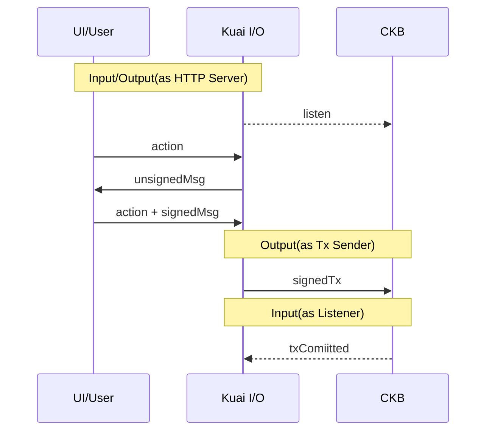
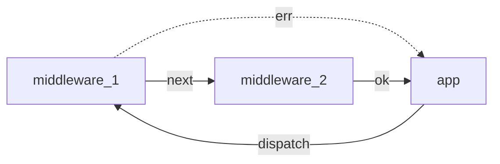
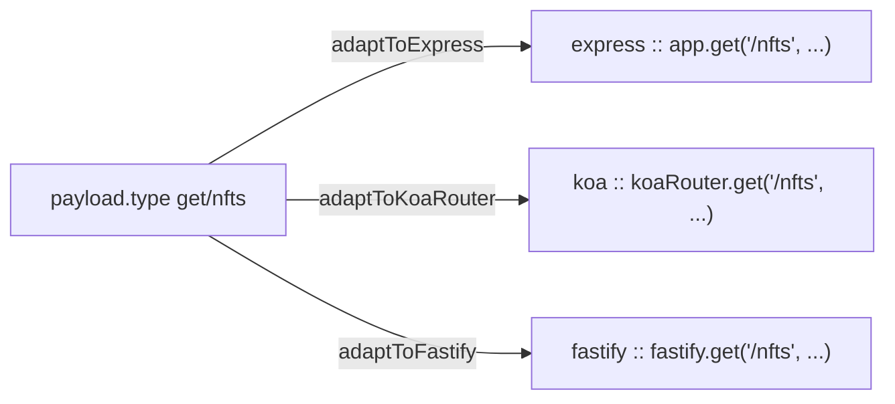

# Kuai Input/Output Layer

Input/Output is an abstract layer between Kuai's business logic and external entities, which may be a dapp user or CKB.



## Builtins Input/Output Layer Components

### Listeners

A listener is an input-only component that is used to input data to Kuai without having to return a value.

It can be used to listen to CKB nodes, to listen to alert services, or to listen to price changes from a centralized
exchange, etc.

```ts
interface Listener<T> {
  on(listen: (obj: T) => void): void;
}

// built-in listeners
interface TipHeaderListener extends Listener {}

interface BlockListener extends Listener {}

interface TransactionListener extends Listener {}

interface ScriptListener extends Listener {}
```

### CKB Provider

The CKB Provider is used to interact with CKB nodes

```ts
interface CellCollector {
  // An API similar to the RXJS operator,
  // but with the steeper learning curve of RXJS,
  // Kuai can provide a similar API directly
  // without requiring developers to learn RXJS from scratch
  takeWhileAggregate(
    initialValue: T,
    aggregate: (aggr: T, cell: Cell, currentIndex: number) => T,
    takeWhile: (aggr: T, currentIndex: number) => boolean,
    excludeLast?: boolean
  ): Promise<T>;
}

interface CkbProvider extends Rpc {
  getFeeRate(): Promise<BI>;

  collector(searchKey: SearchKey): CellCollector;
}
```

## Middleware System

Koa's middleware system is intuitive to developers, and we can design Kuai's middleware to mimic Koa's middleware system



```ts
// `CoR` (Chain of Responsibility), abbr for chain of responsibility (maybe that's not a good name)
// a module that strings middleware together in order
interface Cor {
  use(plugin: Middleware): void;

  dispatch<Payload, Ok>(payload: Payload): Promise<Ok>;
}

type Middleware = (ctx: Context, next: () => Promise<void>) => Promise<void>;

interface Context {
  payload: JsonValue;

  ok(): void;

  ok<OK>(x: OK): void;

  err(): void;

  err<Err>(x: Err): void;
}

type JsonValue =
  | null
  | number
  | string
  | { [key: string]: JsonValue }
  | JsonValue[];
```

### Examples

#### Basic - Give Me Five

```ts
declare function isThirteenPayload(
  x: unknown
): x is { type: "is-thirteen"; value: unknown };

declare function isFivePayload(
  x: unknown
): x is { type: "is-five"; value: unknown };

cor.use(async (ctx, next) => {
  const payload = ctx.payload;

  // route like handler here
  if (isThirteenPayload(payload)) {
    if (payload.value === 13) ctx.ok();
    else ctx.err();
    // the second route
  } else if (isFivePayload(payload)) {
    if (payload.value === 5) ctx.ok("gives you five");
    else ctx.err("please give me five");
  } else {
    await next();
  }
});

cor.dispatch({ type: "is-five", value: 6 }).then(console.log, console.error);
//      👆
// please give me five
```

#### Logger Plugin

This example shows how to write a logger plugin that logs the time

```ts
const tracer: Middleware = async (ctx, next) => {
  const tracerId = crypto.randomUUID();
  ctx.tracer.id = tracerId;

  console.log(Date.now(), tracerId, ctx.payload);
  await next();
  console.log(Date.now(), tracerId, ctx.payload);
};

cor.use(tracer);
```

#### Works with TypeScript

To work better with TypeScript, developers can use the `declare module` method to extend the definition of Context

```ts
declare module "@kuaiproject/io" {
  interface Context {
    ckbProvider: CkbProvider;
  }
}

declare const ckbProviderPlugin: MIddleware;

cor.use(ckbProviderPlugin);
cor.use(async (ctx) => {
  const blockNumber = await ctx.ckbProvider.getBlockNumber();
  // ...
});
```

#### Works with an Event Listener

```ts
declare const blockTipChanged: Listener<number>;

blockTipChanged.on((tipNumber) => {
  cor.dispatch({
    type: "listener/BLOCK_TIP_CHANGED",
    value: tipNumber,
  });
});
```

#### Enhance ok/err

Imagine a scenario where Kuai needs the results of all calls to be signed,
then we can implement a middleware to handle this

```ts
const signResultPlugin: Middleware = async (ctx, next) => {
  const ok = ctx.ok;
  ctx.ok = compose(ok, (value) => ({
    value: value,
    signature: sign(serialize({ payload: ctx.payload, value })),
  }));
  await next();
};

cor.use(signResultPlugin);
```

## Integration with Other Frameworks

Kuai middleware can be integrated with other web frameworks in the form of a convention + Adapter



```ts
adaptToExpress(app /* express instance*/, cor);
adaptToKoa(app /* koa instance*/, cor);
```
