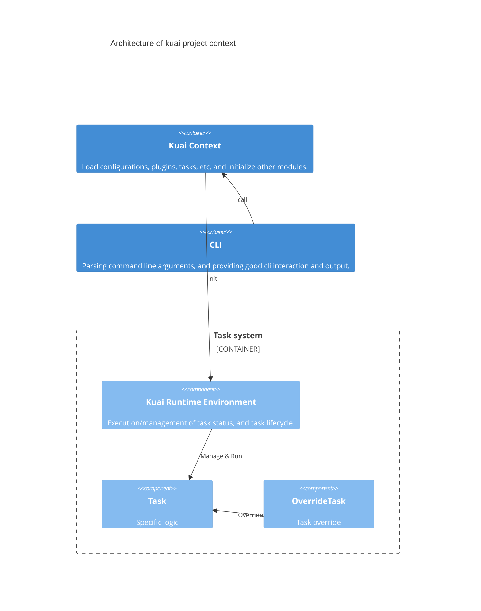
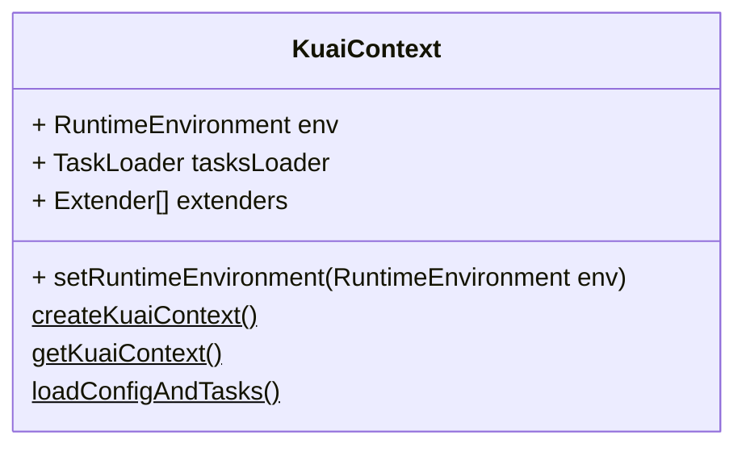
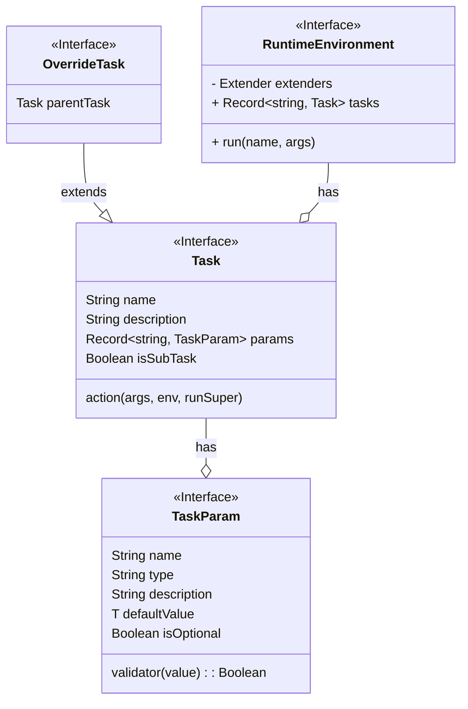
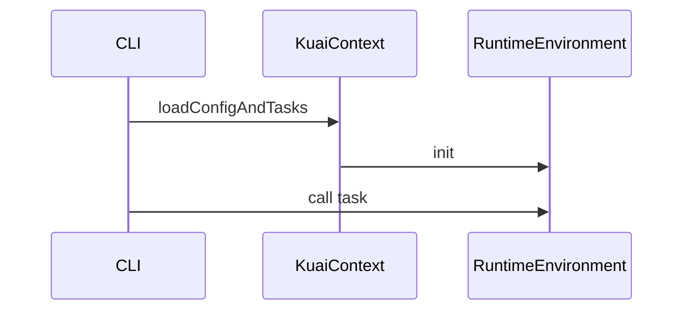

# The design of kuai task system 

## 1. Why we need a task system
As a build system, kuai needs to be able to perform tasks such as compiling, testing, starting nodes, etc. To better manage and expand these tasks, kuai needs a task system. In order to manage and expand these tasks, kuai needs a task system.

## 2. Design target (What)

To achieve the above goals, the task system needs to have the following features
 - dynamically load tasks to facilitate expansion/new custom tasks
 - The task runtime needs to be like an onion model to implement pre/post-processing operations when multiple task handlers are used
 - has a `KuaiContext`, which may have config/anything, usually the context is a singleton (providing the ability to create multiple contexts manually)
 - task can be executed directly from the cli via `npx kuai TASK_NAME`
 - task can be executed manually in the code to facilitate doing e2e tests
 - support subtask

## 3. How it works
Clarifying how many modules there are and what the system architecture looks like first helps us understand how the system works

- `KuaiContext`: Load configurations, plugins, tasks, etc. and initialize other modules.
- `TaskSystem`
  - `RuntimeEnvironment`: Execution/management of task status, and task lifecycle.
  - `Task`: Specific logic
  - `OverrideTask`: extends from `Task`, for override task
- `Kuai CLI`: Parsing command line arguments, and providing good cli interaction and output.



### 3.1. KuaiContext, the entry of the kuai

`KuaiContext` is the entry point for the whole system, responsible for loading config, task, etc... And to prevent multiple `KuaiContext` at runtime, it should be a singleton pattern, and a new instance can be created by `KuaiContext.createKuaiContext()`.



**Possible usage**
```ts
// entry.ts
import { KuaiContext, RuntimeEnvironment } from 'kuai/core'

const ctx = KuaiContext.createKuaiContext();
const config = loadConfigAndTasks();

const env = new RuntimeEnvironment(
  config,
  ctx.tasksLoader.getTasks(),
  ctx.extenders,
);

ctx.setRuntimeEnvironment(env)
```

### 3.2. Task system



### 3.2.1. Task
In the task system, any logic can be a `Task`, which should have a name as the task identifier, a description , params defined, and a task handler. 

In order to implement task override, an `OverrideTask` is needed, which has an additional property of `parentTask` compared to `Task`. When the `action` of `OverrideTask` is run, the `action` of `parentTask` will be passed as `runSuper`, so that the override of task can be implemented

### 3.2.2. RuntimeEnvironment
We now have a simple task definition that allows us to run some logic, but the goal of the task system is to have some simple tasks that combine to accomplish a complex task, so we need a struct that manages all the tasks

`RuntimeEnvironment` is a module to help us manage the execution of `Task` and to share the context between `Task`. When a task is executed, this is passed into the action of task as `env` so that the context can be shared between tasks


#### How to load tasks
When `KuaiContext` calls `loadConfigAndTasks` to initialize the project, it will run the `kuai.config.ts` file. you can put the custom task in it, or refer to the custom task's file in `kuai.config.ts`, so that the task can be injected into `KuaiContext`. and these injected tasks will be passed as parameters when `KuaiContext` initializes `RuntimeEnvironment`.

Some helper functions are also provided in `kuai/core` to help simplify the code

**Possible usage**
```ts
// kuai/core/helper
function task(name, description) {
  const ctx = KuaiContext.getKuaiContext();
  const loader = ctx.tasksLoader;
  return loader.addTask(name, description)
}

// custom-task.ts

import { task } from 'kuai/core'

task(TASK_NAME)
  .addParam("paramA", "a custom param", 'default value')
  .action(async (args, env, runSuper) => {
  // do something…
  })

// kuai.config.ts

import 'custom-plugin.ts'
```

When a `Task` with the same name is registered multiple times, the subsequent `Task` is loaded as an `OverrideTask`, and the previous Task is saved as a `parentTask`

```ts
// custom-override.ts

import { task } from 'kuai/core'

task(TASK_NAME)
  .action(async (args, env, runSuper) => {
    // do something before parent task…
    await runSuper()
    // do something after parent task…
  })
```

#### How to run task

There is a `run` method in `RuntimeEnvironment`, which will find the matched task from `tasks` by name, and when running it will check if the `Task` is an `OverrideTask`, if it is, it will pass the action of its `parentTask` as `runSuper` parameter to the `action` of the task


#### How to extends RuntimeEnvironment

Extending `RuntimeEnvironment` is to add/change some values of `RuntimeEnvironment` when initializing Kuai.

For example, we add a `hi` method to `RuntimeEnvironment`, and then call this `hi` through the task, so that we can achieve the effect of extending the Kuai.

**Possible usage**
```ts
// kuai/core/helper
extendsRuntimeEnvironment(extender: (env: RuntimeEnvironment) => void) {
  const ctx = KuaiContext.getKuaiContext();
  ctx.extenders.push(extender);
}

// kuai.config.ts / custom-plugin.ts
import { extendsRuntimeEnvironment } from 'kuai/core'

extendsRuntimeEnvironment((env) => {
  env.hi = () => {
    console.log('hi')
  }
})

task("hi", async (args, env) => {
  env.hi()
});
```

Will yield:
```
$ npx kuai hi
hi
```

#### Using TypeScript
```ts
// custom-type.ts
import "kuai/types/runtime";

declare module "kuai/types/runtime" {
  export interface RuntimeEnvironment {
    hi: () => void;
  }
}
```

### 3.3. CLI
`CLI` facilitates users to run some scripts and functions in kuai environment, such as `test` / `start node` / `deploy contract` etc.

The cli is mainly implemented by `commander.js`, and the way to use cli in kuai is like this

```
$ npx kuai help        
Kuai version 0.0.1

Usage: kuai [GLOBAL OPTIONS] <TASK> [TASK OPTIONS]

GLOBAL OPTIONS:
  -h, --help     Show help
  -v, --version  Show version number

AVAILABLE TASKS:
  help                  Prints this message
  node                  Starts a JSON-RPC ckb server
  test                  Run tests
```
In this article we focus on how the task system will integrate with cli.

Our task itself has a name and we want to be able to run the task by typing `kuai TASK_NAME` directly, so this requires the cli module to dynamically load commands based on the task.

The `name` of the `Task` will be used as the name of the command, and the `params` will be parsed as options.



**Possible usage**
```ts
// kuai/core/cli.ts
import { Command } from 'commander';
import { loadCommandFromTasks } from './helper';


const program = new Command();

const ctx = KuaiContext.getKuaiContext();
const commands = loadCommandFromTasks(ctx.tasksLoader.getTasks());

commands.forEach((command) => {
  program.addCommand(command);
});
program.parse();
```
