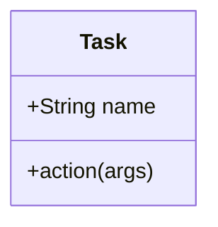

## The design of kuai task system 

### 1. Why we need a task system
As a build system, kuai needs to be able to perform tasks such as compiling, testing, starting nodes, etc. To better manage and expand these tasks, kuai needs a task system. In order to manage and expand these tasks, kuai needs a task system.

### 2. Design target (What)

To achieve the above goals, the task system needs to have the following features
 - dynamically load tasks to facilitate expansion/new custom tasks
 - The task runtime needs to be like an onion model to implement pre/post-processing operations when multiple task handlers are used
 - has a `Context`, which may have config/anything, usually the context is a singleton (providing the ability to create multiple contexts manually)
 - task can be executed directly from the cli via `npx kuai TASK_NAME`
 - task can be executed manually in the code to facilitate doing e2e tests
 - support subtask

### 3. How

#### 3.1. What is Task, How dose it work?
In the task system, any logic can be a task, which should have a name as the task identifier, a description of the args, and a task handler. Based on these definitions, we can make a struct like this




#### 3.2. RuntimeEnvironment, the heart of task system

We now have a simple task definition that allows us to run some logic, but the goal of the task system is to have some simple tasks that combine to accomplish a complex task, so we need a struct that manages all the tasks

#### 3.2.1. How to load tasks

#### 3.2.2. How to run task

#### 3.2.3 How to check task arguments is validity

#### 3.2.4. How to do task override

#### 3.2.5. How to extends RuntimeEnvironment

#### 3.2.6. Using TypeScript

#### 3.3. Cli, the entry of kuai

#### 3.3.1. How integrate with RuntimeEnvironment

#### 3.3.2. How to do cli 


### 4. Summary

#### 4.1. Architecture
 - Cli: integrate task into cli, parse args / match task, use `RuntimeEnvironment` to execute task
 - Context: can get/set some data in the context
 - RuntimeEnvironment: can dynamically load task handler, run task, and check args is valid
 - Task: contains description of task args / description / task handler

#### 4.2. TypeScript interfaces
```ts
interface RuntimeEnvironment {
  readonly _tasks: Map<string, Task>;
  readonly loadTask(task: Task): void;
  readonly run<Args>(taskName: string, args: Args): Promise<unknown>;
}

interface Task {
  readonly name: string;
  readonly description: string;
  readonly options: Option[];
  readonly action: (args: Args, context: RuntimeEnvironment, next: () => Promise<unknown>) => Promise<unknown>;
  readonly addOption(option: Option): void;
}
```


### 5. Example

#### 5.1. Create custom task
```ts
// custom-task.ts
import { task } from 'kuai/core'

task(TASK_NAME)
  .addOption()
  .action(async (args, env, next) => {
  // do something…
  })
```

#### Use context on anything (task handler / test case / code file)
```ts
// func.ts
import { Context } from 'kuai/core';

func() {
  ctx = Context.getContext();

  dosomething(ctx.xxx)

  ctx.doSomething(…)
}
```

#### Extends RuntimeEnvironment
```ts
// custom-plugin.ts
import { extendsEnvironment } from 'kuai/core';

extendsEnvironment((env) => {
  env.hi = 'hello kuai';
})
```

```ts
// custom-type.ts
import "kuai/types/runtime";

declare module "hardhat/types/runtime" {
  export interface RuntimeEnvironment {
    hi: string;
  }
}
```


#### Dyanamic load custom-task to kuai task system
``` ts
// kuai.config.ts

import 'custom-plugin.ts'
```

### Implement

 - [ ] inject dapp templates
 - [ ] run tests
 - [ ] compile
 - [ ] deploy
 - [ ] build a docs website for the project

